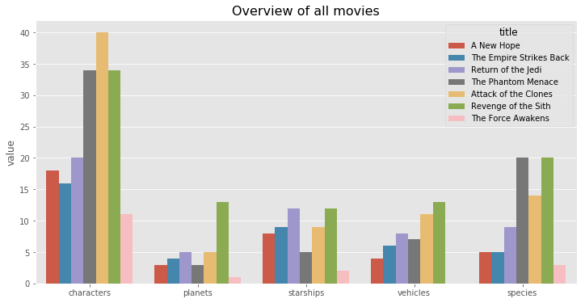
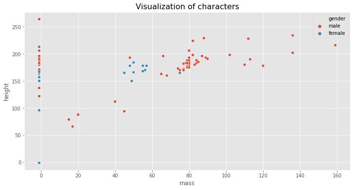

## Data analysis and visualization of knowledge graph for star war movies

[**You can have a look at this Project first **](http://starwar-visualization.s3-website-us-west-1.amazonaws.com)

This project collected data from online database [**SWAPI**](https://swapi.co), which is the world's first quantified and programmatically-accessible data source for all the data from the Star Wars canon universe!

The dataset include 6 APIs: Planets, Spaceships, Vehicles, People, Films and Species, from all SEVEN Star Wars films.

### 1. Data collection

We can get the json file of all data from this website, then use urllib in python3 to download and save data. 

### 2. Basic analysis

"Attack of the Clones" has most characters 

### 3. Build relationship data file

Now we use python to create 3 json files to build our interactive graph, we will use **html、css、javascript and d3 to finish** it.

You can open the `index.html` in this directory, the website is based on it.

### 4. Visualization

The core is D3, **Data Driven Documents**, which is data-driven documents. It is one of the most popular JS visualization libraries. The core idea of D3 is to use data to generate elements on a web page. When data is updated, the appearance and attributes of elements on a web page are modified according to the changes of data.

We need to prepare an `SVG` and `G` as drawing containers in HTML code, then `select ()` the containers in JS code, then `select all ()` the `SVG` elements to be generated, bind data for `SVG` elements using `data (), execute enter (). append ()` and `exit (). remove ()` according to the corresponding state of data and elements, and control `SVG` using `attr ()` to control svg.  Element appearance, and dynamically update the appearance of SVG elements according to user interaction

In order to achieve this graph, we generate circle and text elements based on node data; line elements based on node links; circle and text size and color are controlled according to node data; and when the mouse is hovering and dragging, the corresponding time is triggered, and the appearance and display of elements are changed. The implementation of the timeline is similar. The only difference is that rect element is used here.

